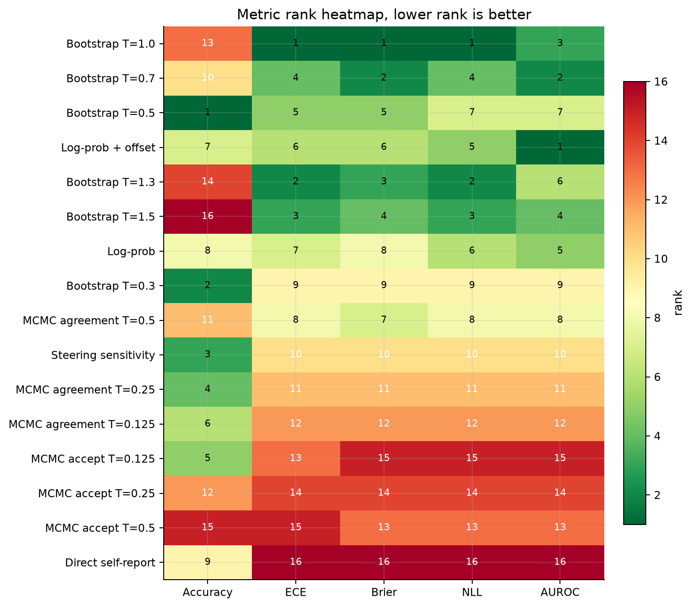
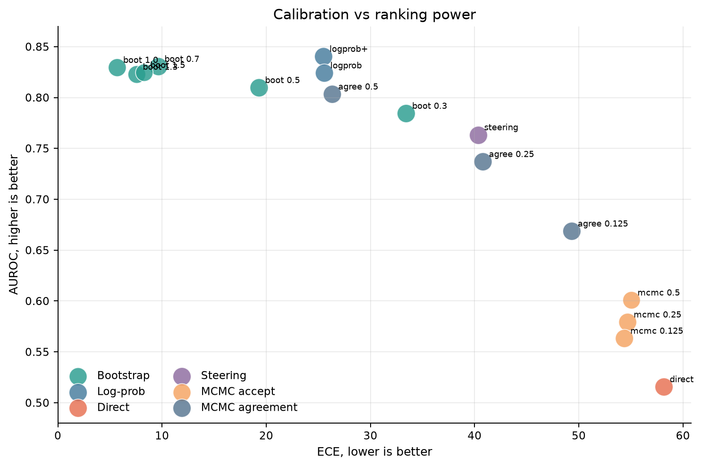
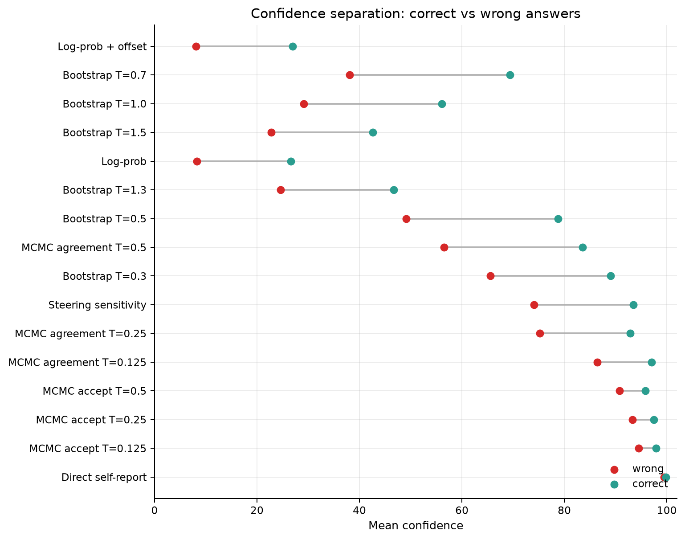
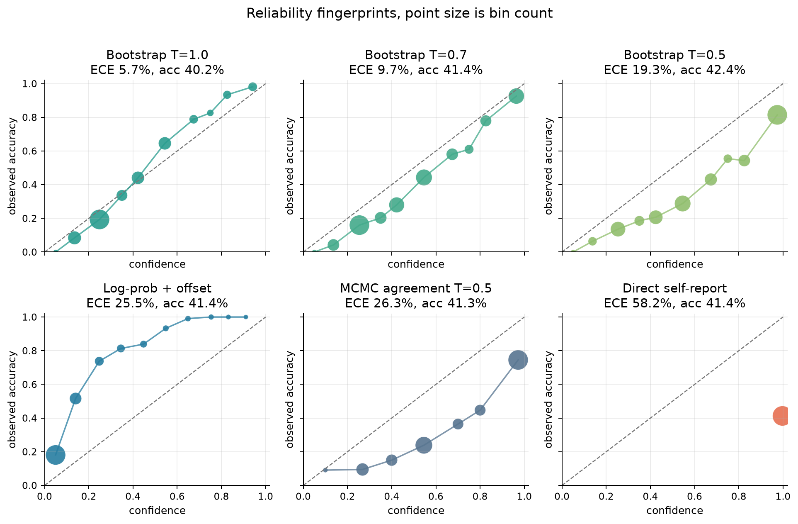
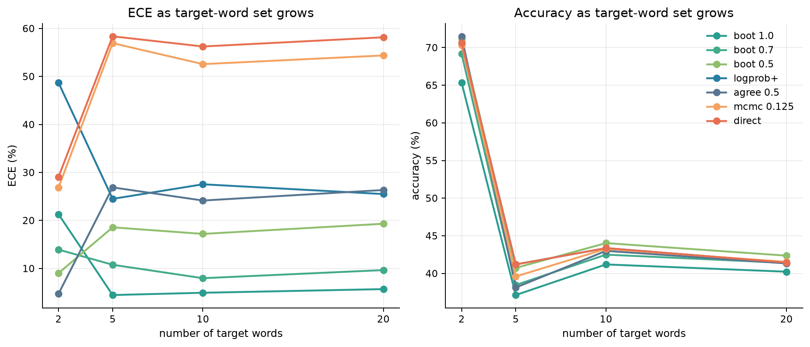
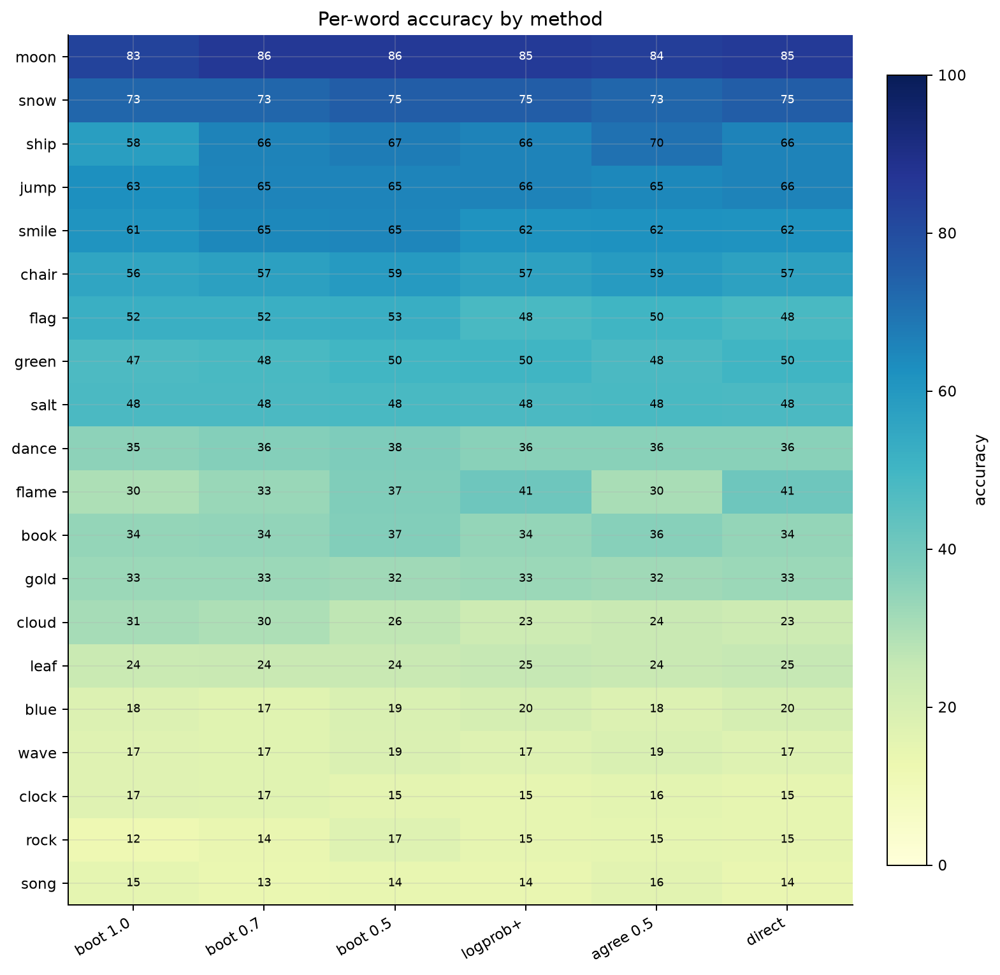

# Taboo UQ latest-run compact report

Generated: 2026-05-11 12:46

Run: `results/qwen3-8b/run_3`  
Checkpoint timestamp: `2026-05-05T08:17:31.739689+00:00`  
Samples: `6000` per full-method summary  
Config hash: `065ebbe03746077a`

## Bottom line

The latest run says the cleanest confidence signal is simple temperature bootstrap at T=1.0. It wins ECE, Brier, and NLL on the full 20-word run: ECE 5.7%, Brier 0.163, NLL 0.498. Accuracy is not the differentiator: the best accuracy method is Bootstrap T=0.5 at 42.4%, while Bootstrap T=1.0 is 40.2%.

Log-prob + offset is the strongest ranker (AUROC 0.840) but is underconfident: mean confidence is 27.0% on correct answers and 8.1% on wrong answers.

Direct self-report is almost always near-certain (99.8% correct vs 99.5% wrong), which leaves it with ECE 58.2% and AUROC 0.516.

Raw MCMC acceptance-ratio confidence is also overconfident (worst raw MCMC ECE 55.1%). The agreement variant helps, but its best N=20 ECE is still 26.3%.

Per-word accuracy is uneven for the calibrated winner: top words are moon 83%, snow 73%, jump 63%, smile 61%; weakest words are wave 17%, clock 17%, song 15%, rock 12%.

## Metric winners

| Metric | winner | value | runner-up | value |
| --- | --- | --- | --- | --- |
| Accuracy | Bootstrap T=0.5 | 42.4% | Bootstrap T=0.3 | 41.9% |
| ECE | Bootstrap T=1.0 | 5.7% | Bootstrap T=1.3 | 7.6% |
| Brier | Bootstrap T=1.0 | 0.163 | Bootstrap T=0.7 | 0.171 |
| NLL | Bootstrap T=1.0 | 0.498 | Bootstrap T=1.3 | 0.519 |
| AUROC | Log-prob + offset | 0.840 | Bootstrap T=0.7 | 0.830 |

## Full scorecard

Sorted by average rank across accuracy, ECE, Brier, NLL, and AUROC.

| method | family | acc | ECE | Brier | NLL | AUROC | avg rank |
| --- | --- | --- | --- | --- | --- | --- | --- |
| Bootstrap T=1.0 | Bootstrap | 40.2% | 5.7% | 0.163 | 0.498 | 0.829 | 3.8 |
| Bootstrap T=0.7 | Bootstrap | 41.4% | 9.7% | 0.171 | 0.558 | 0.830 | 4.4 |
| Bootstrap T=0.5 | Bootstrap | 42.4% | 19.3% | 0.213 | 1.029 | 0.810 | 5.0 |
| Log-prob + offset | Log-prob | 41.4% | 25.5% | 0.246 | 0.730 | 0.840 | 5.0 |
| Bootstrap T=1.3 | Bootstrap | 38.7% | 7.6% | 0.171 | 0.519 | 0.823 | 5.4 |
| Bootstrap T=1.5 | Bootstrap | 36.7% | 8.3% | 0.173 | 0.522 | 0.824 | 6.0 |
| Log-prob | Log-prob | 41.4% | 25.6% | 0.249 | 0.748 | 0.824 | 6.8 |
| Bootstrap T=0.3 | Bootstrap | 41.9% | 33.4% | 0.303 | 2.636 | 0.784 | 7.6 |
| MCMC agreement T=0.5 | MCMC agreement | 41.3% | 26.3% | 0.247 | 1.608 | 0.803 | 8.4 |
| Steering sensitivity | Steering | 41.8% | 40.4% | 0.354 | 4.401 | 0.763 | 8.6 |
| MCMC agreement T=0.25 | MCMC agreement | 41.8% | 40.8% | 0.371 | 4.673 | 0.737 | 9.6 |
| MCMC agreement T=0.125 | MCMC agreement | 41.5% | 49.3% | 0.461 | 7.823 | 0.669 | 10.8 |
| MCMC accept T=0.125 | MCMC accept | 41.5% | 54.4% | 0.534 | 10.771 | 0.563 | 12.6 |
| MCMC accept T=0.25 | MCMC accept | 40.3% | 54.7% | 0.532 | 10.275 | 0.579 | 13.6 |
| MCMC accept T=0.5 | MCMC accept | 37.6% | 55.1% | 0.531 | 9.358 | 0.601 | 13.8 |
| Direct self-report | Direct | 41.4% | 58.2% | 0.580 | 12.658 | 0.516 | 14.6 |

## Calibration vs discrimination

The main tradeoff is visible here: log-prob separates correct from wrong answers well, but its probabilities are too small; direct confidence and raw MCMC acceptance ratios are high without enough separation; T=1.0 bootstrap is the best calibrated compromise.

## Reliability fingerprints

Each point is one confidence bin; larger points have more examples. The diagonal is perfect calibration.

## Controlled target-set size

| N | samples | best ECE | best Brier | best AUROC | best accuracy |
| --- | --- | --- | --- | --- | --- |
| 2 | 600 | MCMC agreement T=0.5 (4.7%) | MCMC agreement T=0.5 (0.166) | Bootstrap T=1.5 (0.843) | Bootstrap T=0.3 (72.2%) |
| 5 | 1500 | Bootstrap T=1.0 (4.5%) | Bootstrap T=1.5 (0.167) | Log-prob + offset (0.815) | Steering sensitivity (42.7%) |
| 10 | 3000 | Bootstrap T=1.0 (4.9%) | Bootstrap T=1.0 (0.169) | Log-prob + offset (0.828) | Steering sensitivity (44.2%) |
| 20 | 6000 | Bootstrap T=1.0 (5.7%) | Bootstrap T=1.0 (0.163) | Log-prob + offset (0.840) | Bootstrap T=0.5 (42.4%) |

## Word-level behavior

The calibrated method is not uniformly mediocre: some words are easy across methods while others remain hard. This matters because aggregate calibration can hide per-word failure modes.

